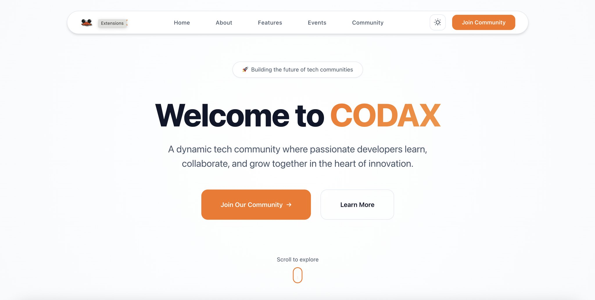
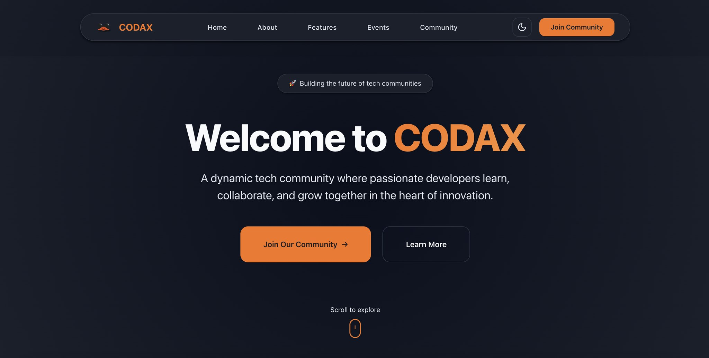

# CODAX Community - HTML & CSS Challenge Submission





## 🏆 CODE'AX CUP Challenge Entry

This is my submission for the **CODE'AX CUP HTML and CSS Challenge** hosted by the Codax Community. The challenge was to create a single-page promotional website that celebrates the Codax community using only HTML and CSS.

## 🎯 Challenge Requirements

**Objective**: Design a single-page promotional blog for Codax that showcases:
- Who we are
- What we do  
- Why developers love us

**Key Requirements**:
- ✅ Single HTML file with embedded CSS
- ✅ No external frameworks or libraries
- ✅ CSS-only animations and interactions
- ✅ Responsive design
- ✅ Bold headers and smooth layouts
- ✅ Engaging visual storytelling

## 🌟 Features Implemented

### 🎨 Design & Layout
- **Modern, Clean Design**: Professional layout with carefully chosen typography and spacing
- **Responsive Grid System**: Custom CSS Grid implementation that adapts to all screen sizes
- **Dark/Light Theme Toggle**: Complete theme switching functionality using pure CSS
- **Smooth Animations**: CSS-only animations including floating elements, fade-ins, and hover effects

### 📱 Responsive Design
- **Mobile-First Approach**: Optimized for mobile devices with progressive enhancement
- **Flexible Grid Layouts**: Adaptive layouts that work on all screen sizes
- **Touch-Friendly Navigation**: Mobile-optimized navigation and interactions

### 🎭 Interactive Elements
- **Hover Effects**: Smooth transitions and transformations on cards and buttons
- **Scroll Animations**: Elements animate into view as users scroll
- **Theme Toggle**: Seamless switching between light and dark modes
- **Navigation Highlights**: Active states and smooth scrolling navigation

## 🏗️ Project Structure

```
codax-html-css-challenge/
├── index.html          # Single file containing all HTML, CSS, and functionality
└── README.md          # This documentation file
```

## 📄 Page Sections

### 1. **Hero Section**
- Eye-catching introduction with animated mascot
- Call-to-action buttons
- Scroll indicator with animated mouse wheel
- Gradient text effects

### 2. **About Codax**
- Community story and journey
- Visual storytelling with images
- Engaging narrative about the community's origins

### 3. **Why Codax?**
- Three key value propositions:
  - Innovation Hub
  - Collaboration
  - Growth
- Icon-based feature cards with hover effects

### 4. **Community Features**
- Four main offerings:
  - Learning Sessions
  - Competitions
  - Networking
  - Mentorship
- Interactive card grid layout

### 5. **Events Section**
- **Kumustahan Sesh**: Monthly community gatherings
- **Byghts**: Quarterly workshops and tech talks
- **Code'ax Cup**: Annual coding competition
- Event cards with scheduling information

### 6. **Community Highlights**
- Statistics showcase:
  - 500+ Active Members
  - 50+ Events Hosted
  - 10+ Partner Universities
  - 100% Community Love
- Member testimonials

### 7. **Call-to-Action**
- Join community section
- Contact information
- Social engagement buttons

### 8. **Footer**
- Branding elements
- Copyright information
- Community tagline

## 🎨 Design System

### Color Palette
```css
/* Primary Colors */
--primary-orange: #f97316
--primary-orange-light: #fb923c
--primary-orange-dark: #ea580c

/* Accent Colors */
--accent-blue: #3b82f6
--accent-purple: #8b5cf6
--accent-green: #10b981
--accent-pink: #ec4899

/* Neutral Colors */
--gray-50 to --gray-900: Complete grayscale palette
```

### Typography
- **Primary Font**: Suisse Intl with system font fallbacks
- **Monospace Font**: System monospace stack
- **Responsive Typography**: Clamp-based fluid scaling

### Spacing System
- **Consistent Scale**: From --space-xs (0.5rem) to --space-4xl (8rem)
- **Semantic Naming**: Easy to understand and maintain

### Border Radius
- **Consistent Rounding**: From --radius-sm to --radius-3xl
- **Modern Aesthetic**: Smooth, rounded corners throughout

## 🌙 Theme System

### Light Theme (Default)
- Clean white backgrounds
- High contrast text
- Subtle shadows and borders

### Dark Theme
- Deep blue/gray backgrounds
- Warm white text
- Enhanced glow effects
- Improved contrast ratios

### Theme Toggle Implementation
```css
#theme-toggle-checkbox:checked ~ .site-container {
  /* Dark theme variables override */
}
```

## 📱 Responsive Breakpoints

### Desktop (Default)
- Full navigation menu
- Multi-column layouts
- Large typography scale

### Tablet (≤768px)
- Simplified navigation
- Adjusted grid layouts
- Optimized spacing

### Mobile (≤480px)
- Single column layouts
- Stacked navigation
- Touch-optimized buttons
- Compressed typography

## ✨ CSS Animations

### Keyframe Animations
- **Float**: Gentle floating motion for mascot
- **FadeInUp**: Elements appearing from bottom
- **SlideInLeft/Right**: Directional entrance animations
- **Scroll**: Mouse wheel animation indicator

### Transition Effects
- **Hover States**: Smooth color and transform transitions
- **Focus States**: Accessibility-friendly focus indicators
- **Theme Switching**: Seamless color transitions

## 🖼️ Assets Used

### Images
- **Codax Logo**: `https://trion-05.github.io/codax.org/img/logo.png`
- **Alternative Logo**: `https://trion-05.github.io/codax.org/img/alt_logo.png`

### Icons
- **SVG Icons**: Custom SVG icons for features and navigation
- **Scalable Design**: Vector-based icons that work at any size

## 🚀 Performance Optimizations

### CSS Optimizations
- **CSS Custom Properties**: Efficient theming and maintenance
- **Minimal Reflows**: Optimized animations using transform and opacity
- **Efficient Selectors**: Well-structured CSS hierarchy

### Loading Performance
- **Single File**: No external dependencies or requests
- **Optimized Images**: External CDN-hosted images
- **Minimal CSS**: Clean, efficient stylesheets

## 🎯 Challenge Compliance

✅ **Single File Requirement**: All HTML and CSS in one file  
✅ **No External Libraries**: Pure HTML and CSS implementation  
✅ **Responsive Design**: Works on all device sizes  
✅ **CSS-Only Animations**: No JavaScript used  
✅ **Visual Storytelling**: Engaging narrative structure  
✅ **Community Focus**: Showcases Codax values and events  
✅ **Professional Quality**: Production-ready code  

## 🛠️ Technical Highlights

### Advanced CSS Techniques
- **CSS Grid & Flexbox**: Modern layout systems
- **Custom Properties**: Maintainable theming system
- **Pseudo-elements**: Enhanced visual effects
- **Media Queries**: Responsive design implementation
- **Transform & Transition**: Smooth animations

### Accessibility Features
- **Semantic HTML**: Proper heading hierarchy and structure
- **ARIA Labels**: Screen reader friendly navigation
- **Keyboard Navigation**: Full keyboard accessibility
- **Color Contrast**: WCAG compliant color ratios
- **Focus Management**: Visible focus indicators

## 🎨 Design Philosophy

### User Experience
- **Progressive Enhancement**: Works without JavaScript
- **Mobile-First**: Optimized for mobile devices
- **Performance-Focused**: Fast loading and smooth interactions
- **Accessible**: Inclusive design for all users

### Visual Design
- **Modern Aesthetic**: Contemporary design trends
- **Brand Consistency**: Cohesive Codax branding
- **Visual Hierarchy**: Clear information architecture
- **Engaging Interactions**: Delightful user interactions

## 🏆 Submission Details

- **Event**: CODE'AX CUP - HTML & CSS Challenge
- **Community**: Codax Community
- **Submission Date**: 2025
- **File Size**: Single HTML file (~35KB)
- **Browser Compatibility**: Modern browsers (Chrome, Firefox, Safari, Edge)

## 🤝 Acknowledgments

Special thanks to the **Codax Community** for organizing this challenge and providing:
- Clear challenge requirements
- Resource links and assets
- Supportive community environment
- Opportunity to showcase HTML/CSS skills

---

**Made with ❤️ for the Codax Community**  
*Building the future of tech communities, one developer at a time.* 